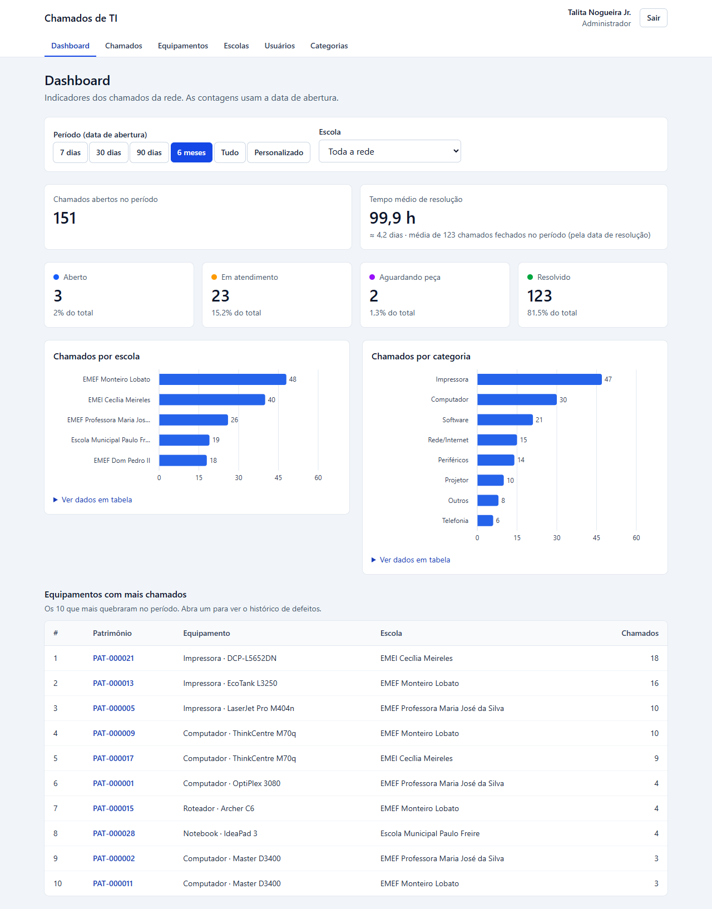
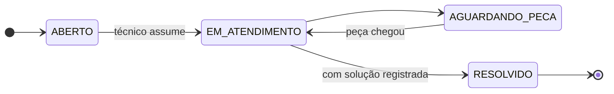
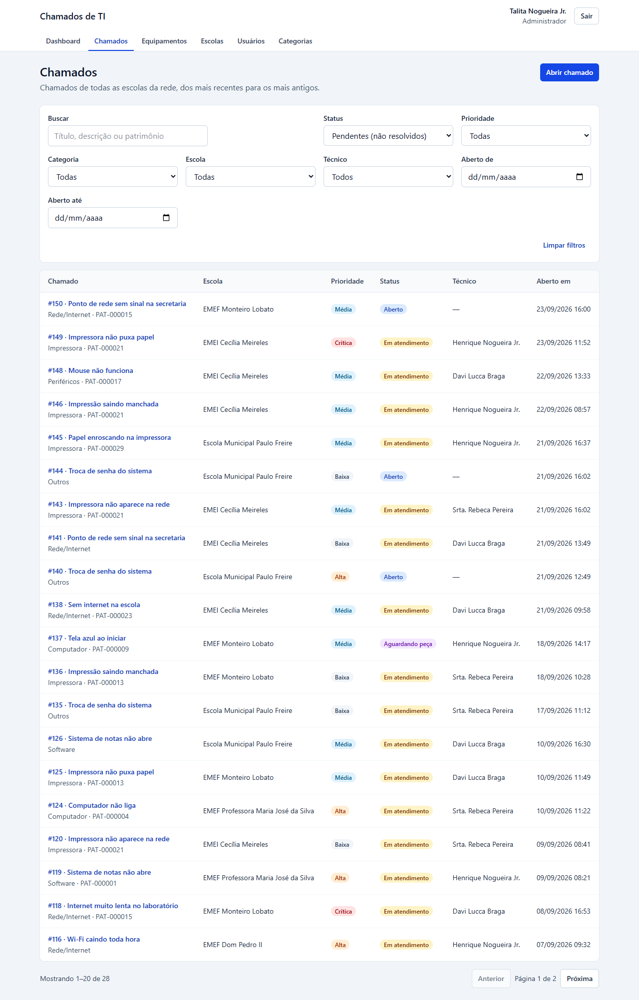
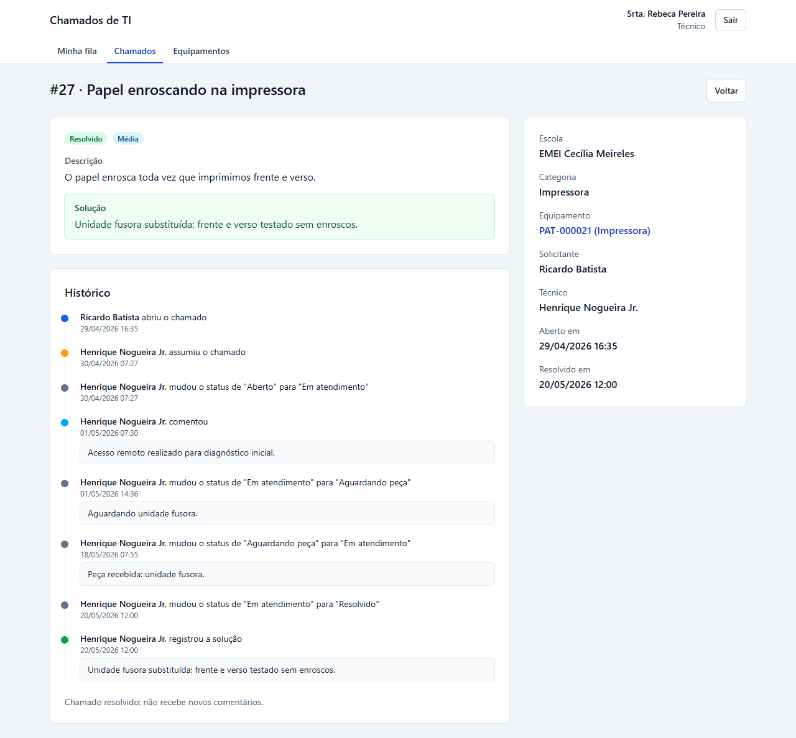
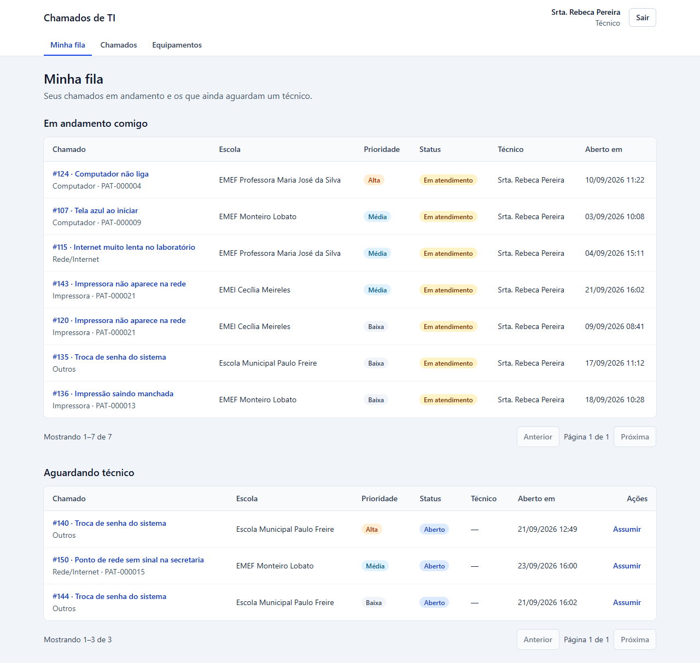
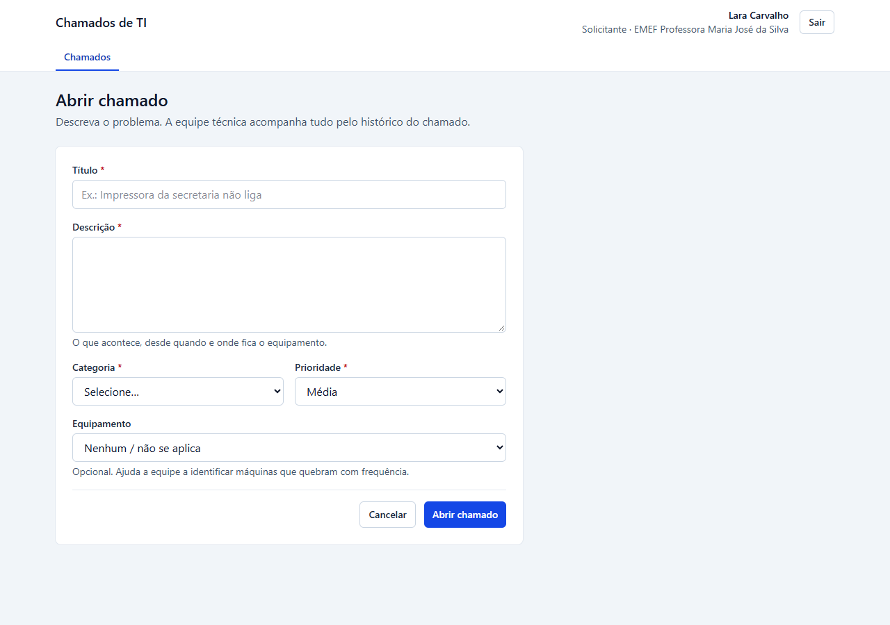
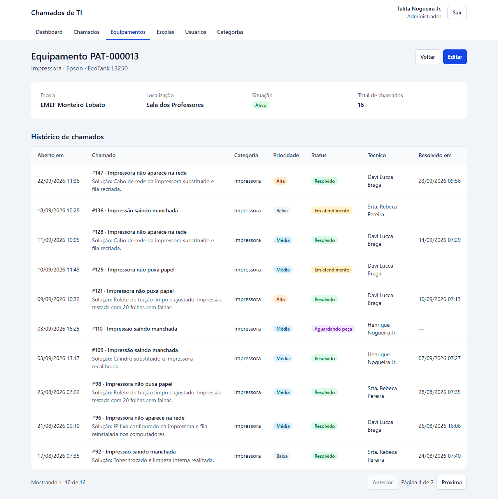
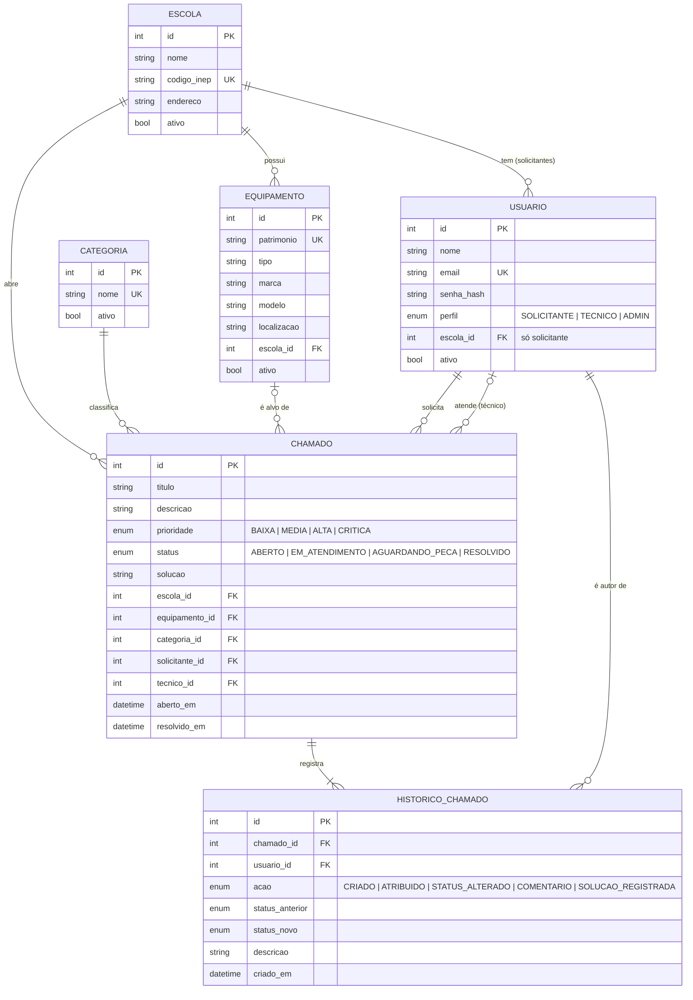
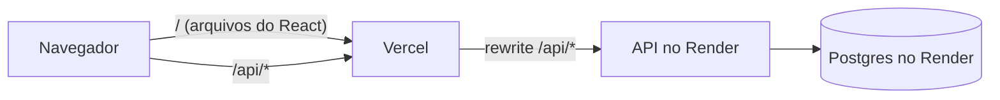

# Chamados de TI

[](https://github.com/thiagoizdro/Chamado-ti/actions/workflows/ci.yml)

Sistema full stack para escolas de uma rede de ensino abrirem chamados de TI (impressora parada, PC sem internet, projetor com defeito). A equipe técnica assume, atende e registra a solução; a gestão acompanha indicadores num dashboard.

**🔗 Demo:** _link será adicionado após o deploy_ · credenciais de teste [logo abaixo](#credenciais-de-teste)

> ⏳ **A primeira requisição pode levar até 1 minuto.** A API roda no plano gratuito do Render, que desliga o serviço após 15 minutos sem uso. Se o login demorar ou falhar na primeira tentativa, aguarde alguns segundos e tente de novo.



## O problema

Numa rede municipal de ensino, os problemas de TI costumam chegar por telefone, WhatsApp ou recado no corredor. Sem registro, ninguém sabe o que está pendente, quem está cuidando de quê, nem quais máquinas quebram toda semana.

O sistema organiza esse fluxo em três perfis:

| Perfil          | Quem é                   | O que faz                                                                                            |
| --------------- | ------------------------ | ---------------------------------------------------------------------------------------------------- |
| **Solicitante** | Diretor(a) ou secretaria | Abre chamados e acompanha os da **sua** escola                                                       |
| **Técnico**     | Equipe de TI             | Vê todos os chamados, assume, muda status, comenta e registra a solução; consulta os equipamentos    |
| **Admin**       | Gestão da rede           | Tudo do técnico + cadastros (escolas, usuários, categorias, equipamentos) + dashboard de indicadores |

Cada chamado segue um fluxo de status com histórico completo e imutável:



## Telas

| Chamados com filtros (estado na URL)                | Detalhe com linha do tempo                                  |
| --------------------------------------------------- | ----------------------------------------------------------- |
|  |  |

| Minha fila (técnico)                           | Abertura de chamado (solicitante)                    | Equipamento e seu histórico de defeitos                             |
| ---------------------------------------------- | ---------------------------------------------------- | ------------------------------------------------------------------- |
|  |  |  |

## Credenciais de teste

Todos os usuários usam a senha **`Senha@123`**. Cada perfil vê um menu diferente.

| Perfil      | E-mail                                 | Escola                              | Página inicial     |
| ----------- | -------------------------------------- | ----------------------------------- | ------------------ |
| ADMIN       | `admin@chamados.dev`                   | —                                   | Dashboard          |
| TECNICO     | `tecnico1@chamados.dev`                | —                                   | Minha fila         |
| TECNICO     | `tecnico2@chamados.dev`                | —                                   | Minha fila         |
| TECNICO     | `tecnico3@chamados.dev`                | —                                   | Minha fila         |
| SOLICITANTE | `direcao.mariajose@chamados.dev`       | EMEF Professora Maria José da Silva | Chamados da escola |
| SOLICITANTE | `direcao.monteirolobato@chamados.dev`  | EMEF Monteiro Lobato                | Chamados da escola |
| SOLICITANTE | `direcao.ceciliameireles@chamados.dev` | EMEI Cecília Meireles               | Chamados da escola |
| SOLICITANTE | `direcao.paulofreire@chamados.dev`     | Escola Municipal Paulo Freire       | Chamados da escola |
| SOLICITANTE | `direcao.dompedro@chamados.dev`        | EMEF Dom Pedro II                   | Chamados da escola |

Um roteiro rápido: entre como **solicitante** e abra um chamado; entre como **técnico**, assuma-o na Minha fila e resolva; entre como **admin** e veja o chamado no dashboard.

## Stack

| Camada    | Tecnologias                                                                                                           |
| --------- | --------------------------------------------------------------------------------------------------------------------- |
| API       | Node.js 24, TypeScript, Express 5, Prisma 7 (driver adapter `pg`), PostgreSQL 16, Zod, JWT em cookie httpOnly, bcrypt |
| Web       | React 19, Vite, Tailwind CSS v4, React Router, TanStack Query, React Hook Form + Zod, Axios, Recharts                 |
| Qualidade | Vitest + Supertest (Postgres real), ESLint (flat config), Prettier, TypeScript `strict`, GitHub Actions               |
| Infra     | Docker Compose (dev), Render (API + Postgres), Vercel (front)                                                         |

## Modelo de dados



## Decisões técnicas e trade-offs

**Segurança e acesso**

- **Escopo por escola no `where`, não só no perfil.** Checar "é solicitante?" não basta: o filtro `escolaId` do usuário logado entra na própria consulta do Prisma. Um chamado de outra escola simplesmente "não existe" para ele e responde **404, não 403**, o que evita IDOR e não revela que o id existe.
- **JWT em cookie httpOnly, `SameSite=Lax`, `Secure` em produção.** O JavaScript da página não consegue ler o token (protege contra roubo via XSS). Front e API ficam na **mesma origem** para o navegador (proxy do Vite em dev, rewrite da Vercel em produção), então o cookie é first-party e o CORS fica só como salvaguarda restrita.
- **O middleware de autenticação consulta o banco a cada requisição.** Custa uma query, mas desativar um usuário ou mudar o perfil dele vale na hora, sem esperar o token de 8 horas expirar.

**Consistência dos dados**

- **Histórico dentro da mesma transação.** Toda alteração no chamado grava o registro de histórico na mesma `prisma.$transaction`. Os testes provam isso com um trigger temporário no Postgres que faz o insert do histórico falhar: a mudança de status é desfeita junto.
- **"Assumir" à prova de concorrência.** `updateMany` com `where { id, status: ABERTO, tecnicoId: null }`: se dois técnicos clicarem juntos, o banco garante que só um atualiza a linha; o outro recebe `count = 0` e um **409**. A mudança de status usa a mesma técnica com o status atual no `where`.
- **Máquina de estados num só lugar** (`modules/chamados/status.ts`), usada pela API e pelo seed. O front tem um espelho só para decidir quais botões mostrar; quem valida é sempre a API.
- **Soft delete** em escolas, usuários, categorias e equipamentos: nada com chamados é apagado.

**Arquitetura**

- **Camadas `routes → controllers → services → Prisma`.** Controller só lida com HTTP; toda regra fica no service, que é o que os testes exercitam.
- **Validação com Zod em middleware**, com erros por campo (`{ mensagem, erros: { campo: msg } }`) que o front coloca embaixo do input certo. Erros de negócio usam `AppError(status, mensagem, campo?)` e um middleware central (P2002 do Prisma vira 409 amigável).
- **Estado dos filtros na URL** (`useSearchParams`): lista filtrada sobrevive a F5, ao botão voltar e pode ser compartilhada por link. A busca tem debounce de 300 ms e não empilha histórico a cada tecla.

**Dashboard**

- **Tempo médio de resolução via `$queryRaw`**: é uma média de diferença entre datas, que o Prisma não expressa. O template do `$queryRaw` parametriza os valores (sem risco de SQL injection).
- **Dois recortes de data, explicitados na tela:** as contagens usam a data de abertura; o tempo médio usa os chamados resolvidos no período.
- **Período no fuso da rede (-03:00).** As datas ficam em UTC no banco, mas "até 30/09" precisa incluir um chamado aberto às 23h30 do dia 30 (que em UTC já é 01/10). Há teste para esse caso.
- **Dashboard carregado sob demanda:** o Recharts é a maior dependência do front e só o admin usa; solicitantes e técnicos não baixam esse código.

**Testes**

- **Postgres real em vez de mocks** (banco separado `*_test`, com trava que impede rodar em outro). As regras mais importantes vivem no banco (transações, concorrência, busca case-insensitive) e só um banco de verdade as testa.
- **Seed determinístico e testado:** a simulação dos chamados é uma função pura, com testes de invariantes (nada RESOLVIDO sem técnico, `resolvidoEm` sempre depois de `abertoEm`, eventos em horário escolar etc.).

**Trade-offs assumidos**

- Paginação por `offset` (simples e suficiente para o volume de uma rede de escolas; cursor seria o próximo passo com muito volume).
- Busca com `ILIKE` em vez de full-text: atende bem centenas/milhares de chamados; `tsvector` está nos próximos passos.
- Hospedagem gratuita: cold start de até ~1 minuto e banco gratuito do Render com prazo de validade (ver [Deploy](#deploy)).

## Como rodar com Docker

Pré-requisito: Docker Desktop (no Windows, com WSL 2).

```bash
cp .env.example .env
docker compose up --build
docker compose exec api npm run db:seed   # dados de exemplo (uma vez)
```

- Web: http://localhost:5173
- API: http://localhost:3333/api/health (ou http://localhost:5173/api/health pelo proxy do Vite)

A API aplica as migrations automaticamente ao subir (`prisma migrate deploy`). O `.env.example` já funciona para desenvolvimento; em qualquer ambiente real, troque o `JWT_SECRET` (o comando para gerar está no próprio arquivo).

> Os `node_modules` ficam em volumes do container. Depois de mudar dependências, recrie os volumes com `docker compose up --build -V`.

### Sem Docker (só o banco no Docker)

```bash
cp .env.example .env
npm install
docker compose up -d db
npm run db:deploy -w apps/api
npm run db:seed -w apps/api
npm run dev -w apps/api   # API em http://localhost:3333
npm run dev -w apps/web   # Web em http://localhost:5173
```

### Dados de exemplo (seed)

O seed usa uma semente fixa e gera 5 escolas, 8 categorias, 40 equipamentos e 150 chamados nos últimos 6 meses, com histórico coerente (cada chamado percorre o fluxo de status em ordem cronológica, em horário escolar). Alguns equipamentos concentram mais defeitos, e parte dos chamados recentes ainda está em andamento. As datas são relativas ao momento em que o seed roda, então os dados estão sempre "recentes".

Para recriar o banco do zero: `npm run db:reset -w apps/api`.

## Testes e CI

```bash
docker compose up -d db
npm test
```

Os testes da API usam um banco separado (`chamados_ti_test`), criado e migrado automaticamente na primeira execução, e se recusam a rodar em um banco cujo nome não termine em `_test`. Cobrem autenticação, permissões por perfil, escopo do solicitante, máquina de estados, transação do histórico, concorrência ao assumir, filtros e o dashboard.

O [workflow de CI](.github/workflows/ci.yml) roda a cada push e pull request: Prettier, ESLint, typecheck, build da API e do front e os testes contra um Postgres 16 de verdade (service do GitHub Actions).

| Comando                          | O que faz                                |
| -------------------------------- | ---------------------------------------- |
| `npm run lint`                   | ESLint no monorepo                       |
| `npm run typecheck`              | TypeScript (api e web)                   |
| `npm test`                       | Testes da API (Vitest)                   |
| `npm run format`                 | Formata o código com Prettier            |
| `npm run db:migrate -w apps/api` | Cria/aplica migration em desenvolvimento |
| `npm run db:seed -w apps/api`    | Popula o banco com os dados de exemplo   |
| `npm run db:reset -w apps/api`   | Recria o banco do zero e roda o seed     |

## Deploy



- **API + Postgres no Render**, descritos como código no [`render.yaml`](render.yaml) (Blueprint). Build: `npm ci --include=dev && npx prisma generate && npm run build`; start: `npx prisma migrate deploy && node dist/server.js`. O `JWT_SECRET` é gerado pelo próprio Render.
- **Front na Vercel**, com o [`apps/web/vercel.json`](apps/web/vercel.json): o rewrite manda `/api/*` para a API no Render e as demais rotas para o `index.html` (SPA). Para o navegador tudo vem da mesma origem, então o cookie de sessão é first-party.
- **Limitações do plano gratuito:** a API "dorme" após 15 minutos sem uso (cold start de até ~1 minuto) e o Postgres gratuito do Render expira depois de um período; para manter a demo no ar, recrie o banco e rode o seed de novo.

## Próximos passos

Ficaram fora do MVP de propósito:

- Notificação por e-mail (abertura, atribuição e resolução)
- Upload de foto do defeito
- App mobile
- Reabertura de chamado resolvido
- SLA por prioridade com alertas
- Tempo médio de resolução descontando o tempo em "Aguardando peça"
- Busca full-text com `tsvector`
